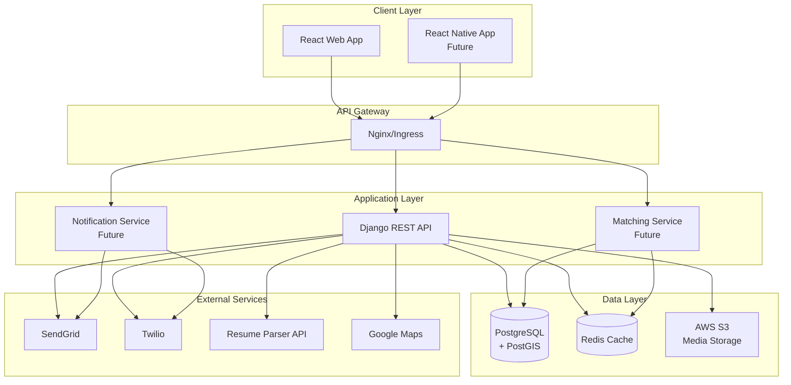

# MishMob Architecture

## System Overview



## Directory Structure

```
mishmob/
├── frontend/              # React frontend application
│   ├── src/              # Source code
│   │   ├── components/   # Reusable UI components
│   │   ├── pages/        # Page components
│   │   ├── services/     # API service layer
│   │   ├── contexts/     # React contexts
│   │   └── hooks/        # Custom hooks
│   └── public/           # Static assets
│
├── backend/              # Django backend API
│   ├── api/             # API endpoints
│   ├── users/           # User management
│   ├── opportunities/   # Opportunities management
│   ├── lms/            # Learning management
│   └── mishmob/        # Django settings
│
└── infra/               # Infrastructure configurations
    ├── kubernetes/      # K8s manifests
    ├── helm/           # Helm charts
    └── terraform/      # Infrastructure as code
```

## Data Flow

### User Registration Flow
1. User submits registration form (React)
2. Frontend validates and sends to API
3. Django creates user account
4. JWT tokens generated and returned
5. Frontend stores tokens and redirects

### Opportunity Matching Flow
1. User uploads resume or enters skills
2. Resume parser extracts skills (if applicable)
3. Matching algorithm queries opportunities
4. Results ranked by relevance
5. Frontend displays matched opportunities

### Application Flow
1. Volunteer selects opportunity
2. Application submitted with cover letter
3. Host notified via email
4. Host reviews and accepts/rejects
5. Volunteer notified of decision

## Technology Decisions

### Frontend: React + TypeScript
- **Why**: Type safety, component reusability, large ecosystem
- **Alternative considered**: Next.js (decided against SSR complexity)

### Backend: Django + Django Ninja
- **Why**: Rapid development, excellent ORM, admin interface
- **Alternative considered**: FastAPI (chose Django for batteries-included approach)

### Database: PostgreSQL + PostGIS
- **Why**: Geospatial queries for location-based matching
- **Alternative considered**: MongoDB (needed relational data integrity)

### Container Orchestration: Kubernetes
- **Why**: Industry standard, horizontal scaling, self-healing
- **Alternative considered**: Docker Swarm (less ecosystem support)

## Security Considerations

### Authentication & Authorization
- JWT tokens with refresh tokens
- Role-based access control (Volunteer, Host, Admin)
- Django's built-in security features

### Data Protection
- HTTPS everywhere
- Encrypted passwords (Django's default)
- Environment variables for secrets
- CORS properly configured

### API Security
- Rate limiting
- Input validation with Pydantic
- SQL injection protection (Django ORM)
- XSS protection (React's default escaping)

## Scaling Strategy

### Horizontal Scaling
- Stateless API servers
- Load balancer distributing traffic
- Database read replicas
- Redis for session storage

### Caching Strategy
- Redis for frequently accessed data
- CDN for static assets
- Browser caching headers
- API response caching

### Future Microservices
1. **Matching Service**: Dedicated service for complex matching algorithms
2. **Notification Service**: Handle email/SMS queuing and delivery
3. **Analytics Service**: Track platform metrics and user behavior
4. **Search Service**: Elasticsearch for full-text search

## Deployment Pipeline

### Development
1. Local development with Docker Compose
2. Feature branches in Git
3. PR reviews required
4. Automated tests on PR

### Staging
1. Merge to develop branch
2. GitHub Actions builds images
3. Deploy to staging K8s cluster
4. Run integration tests

### Production
1. Merge to main branch
2. Tag release version
3. Build production images
4. Blue-green deployment
5. Health checks before switching
6. Automatic rollback on failure

## Monitoring & Observability

### Metrics (Prometheus)
- API response times
- Error rates
- Resource utilization
- Business metrics

### Logging (ELK Stack)
- Centralized log collection
- Error tracking
- User activity logs
- Security audit logs

### Tracing (Jaeger)
- Distributed request tracing
- Performance bottleneck identification
- Service dependency mapping

### Alerting
- PagerDuty integration
- Slack notifications
- Email alerts for critical issues